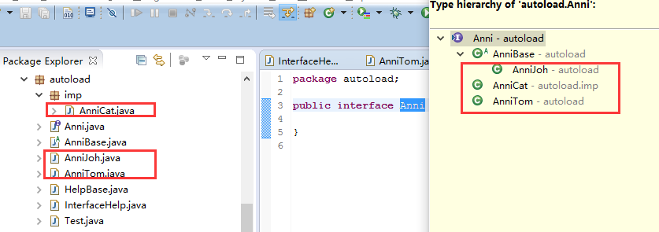
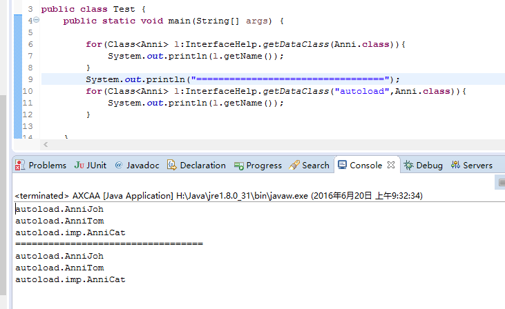
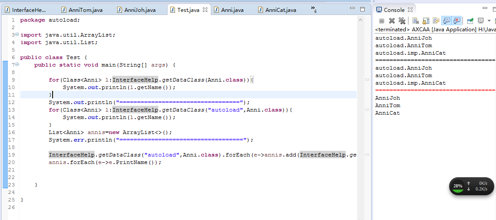

# InterfaceAotuLoad
## interfaceAotuLoad简介
* interfaceAotuLoadd是一个在我写通用图表展示webapp时候偶然实现的，里面大量调用了VFS内容，今天抽出是时间，整理出来，搞成单独的类，这样就方便对了。
* 主要功能是实现自动寻找特定包下的接口或者抽象类的具体实现，然后进行操作。
* 例如泛着加入List Map，实现接口统一操作，十分灵便，并且能自动包。
* 下面是截图，玩借口很是吊炸天，具体自己体会

##截图

##截图

##截图

* 邮件(hacker.kill07@gmail.com)
* QQ: 985390927
* weibo: [@Alden_情绪控](http://weibo.com/Sweets07)
* Blog: [http://www.zhaoguilin.com](http://www.zhaoguilin.com)